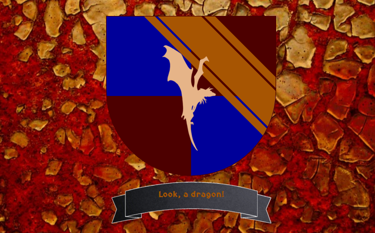
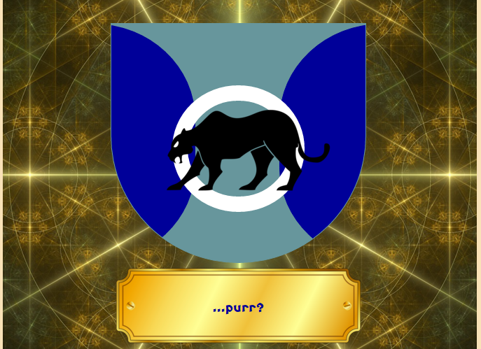
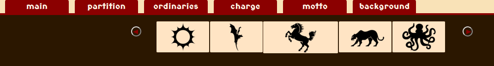

#HERALDRY#

The <a href="http://adrianaalter.github.io/Heraldry/">heraldry app</a> allows users to design a fully customizable coat of arms, by using React components to keep track of their selections.  All of the geometric shapes--that is, the shield, the partitions, and the ordinaries--are drawn in pure CSS.  The randomization feature uses a custom algorithm to generate billions of possible results.

</img>
</img>
</img>

The menu implements a hand-rolled carousel component; code for a fuller version of the carousel, along with instructions for using it, lives here:  <a href="https://github.com/AdrianaAlter/Carousel">Carousel</a>

</img>

<a href="http://adrianaalter.github.io/Heraldry/">Live App</a>
